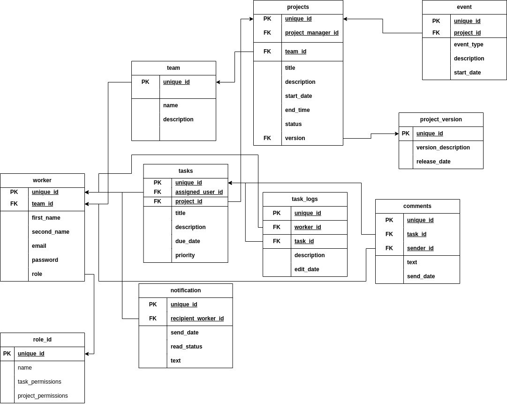

# DM-DMBS

Data models and database management systems.

# Student Egor Bagrovets group 153504

Проектом является CRM система для отслеживания процесса разработки.

# Functional requirements

Админ
+ Управление работниками (CRUD)
+ Закреплениие работников за командой 
+ Управление проектами (CRUD)
+ Отслеживане сроков выполнения задач

PM
+ Авторизация работника
+ Управление задачами (CRUD)
+ Отслеживание сроков выполнения проектов и задач
+ Получение отчётности проектов и задач
+ Уведомления о сроках выполнения и изменениях в задачах и проектах
+ Изменение статуса задач
+ Управление ивентами (CRUD)
+ Уведомления о сроках выполнения и изменениях в задачах и проектах

Работник
+ Авторизация работника
+ Комментирование задач
+ Логирование времени выполнения задач

# Database schem

# worker

unique_id (PK, int) - Уникальный идентификатор сотрудника.
team_id (PK, int) - Уникальный идентификатор команды, к которой принадлежит сотрудник.
first_name (varchar) - Имя сотрудника.
second_name (varchar) - Фамилия сотрудника.
email (varchar) - Электронная почта сотрудника.
password (varchar) - Пароль сотрудника.
role (varchar) - Роль сотрудника в команде или системе.

- Связи с другими сущностями:

team_id связан с PK из таблицы workers (one to one).

Эта сущность описывает информацию о сотрудниках и их принадлежность к командам в CRM системе.

# project_manager
unique_id (PK, int) - Уникальный идентификатор проектного менеджера.
worker_id (FK, int) - Уникальный идентификатор сотрудника, связанного с данной ролью проектного менеджера.
team_id (FK, int) - Уникальный идентификатор команды, к которой принадлежит этот проектный менеджер.

- Связи с другими сущностями:

worker_id связан с PK сотрудника в таблице workers. (one to one)
team_id связан с PK команды в таблице teams. (one to many)

Эта сущность описывает информацию о проектных менеджерах, их связь  командами и проектами в CRM системе.

# teams
unique_id (PK, int) - Уникальный идентификатор команды.
project_id (FK, int) - Уникальный идентификатор проекта, к которому принадлежит данная команда.
name (varchar) - Название команды.
description (text) - Описание команды.

- Связи с другими сущностями:

project_id связан с PK проекта в таблице projects (one wo many)
По средствам этой сущности устанавливается отношение между сущностями projects и workers как many ot many

Эта сущность описывает информацию о командах, их названия, описания и принадлежность к проектам в CRM системе.

# projects

unique_id (PK, int) - Уникальный идентификатор проекта.
project_manager_id (FK, int) - Уникальный идентификатор проектного менеджера, ответственного за проект.
title (varchar) - Название проекта.
description (text) - Описание проекта.
start_date (date) - Дата начала проекта.
end_date (date) - Планируемая дата окончания проекта.
status (varchar) - Статус проекта (например, "Активный", "Завершенный" и т. д.).
version (FK, int) - Уникальный идентификатор версии проекта, если такая связь существует.

- Связи с другими сущностями:

project_manager_id связан с PK в таблице project_manager (one to many).
version связан с PK версии проекта в таблице project_versions.

Эта сущность описывает информацию о проектах, их названия, описания, датах начала и окончания, статусе и связь с проектным менеджером и версией проекта в CRM системе.

# project_versions

unique_id (PK, int) - Уникальный идентификатор версии проекта.
version_description (text) - Описание версии проекта.
release_date (date) - Дата выпуска версии.

Эта сущность описывает информацию о версиях проектов, их описании и датах выпуска в CRM системе.

# events

unique_id (PK, int) - Уникальный идентификатор события.
project_id (FK, int) - Уникальный идентификатор проекта, к которому относится данное событие.
event_type (varchar) - Тип события (например, "Встреча", "Конференция", "Семинар" и т. д.).
description (text) - Описание события.
start_date (date) - Дата начала события.

- Связи с другими сущностями:

project_id связан с PK проекта в таблице projects (one to many)

Эта сущность описывает информацию о событиях, связанных с проектами, их типах, описании и датах начала в CRM системе.

# tasks
unique_id (PK, int) - Уникальный идентификатор задачи.
assigned_user_id (FK, int) - Уникальный идентификатор пользователя (сотрудника), которому назначена данная задача.
project_id (FK, int) - Уникальный идентификатор проекта, к которому относится данная задача.
title (varchar) - Заголовок задачи.
description (text) - Описание задачи.
due_date (date) - Дедлайн выполнения задачи.
priority (varchar) - Приоритет задачи (например, "Высокий", "Средний", "Низкий" и т. д.).

- Связи с другими сущностями:

assigned_user_id связан с PK сотрудника в таблице workers (one to many)
project_id связан с PK проекта в таблице projects (one to many)

Эта сущность описывает информацию о задачах, их заголовке, описании, дедлайне, приоритете и связях с пользователями и проектами в CRM системе.

# task_logs

unique_id (PK, int) - Уникальный идентификатор записи в логе задачи.
worker_id (FK, int) - Идентификатор сотрудника, который внес запись в лог задачи.
task_id (int) - Уникальный идентификатор задачи, к которой относится данная запись в логе.
description (text) - Описание изменения или события, связанного с задачей.
edit_date (datetime) - Дата и время внесения записи в лог.
Связи с другими сущностями:

worker_id связан с сотрудником в таблице worker (one to one)
task_id связан с  задачей в таблице tasks (one to one)

Эта сущность описывает логи и записи о событиях и изменениях, связанных с задачами, их описания, датах и связях с сотрудниками и задачами в CRM системе.

# notifications

unique_id (PK, int) - Уникальный идентификатор уведомления.
recipient_worker_id (FK, int) - Уникальный идентификатор сотрудника-получателя уведомления.
send_date (datetime) - Дата и время отправки уведомления.
read_status (varchar) - Статус прочтения уведомления (например, "Прочитано", "Не прочитано").
text (text) - Текст уведомления.

Связи с другими сущностями:

recipient_worker_id связан с PK сотрудника в таблице worker (one to many )

Эта сущность описывает информацию о уведомлениях, их тексте, дате отправки, статусе прочтения и связи с сотрудниками в CRM системе.

# comments

unique_id (PK, int) - Уникальный идентификатор комментария.
task_id (FK, int) - Уникальный идентификатор задачи, к которой относится данный комментарий.
sender_id (FK, int) - Уникальный идентификатор отправителя комментария (предполагая, что это сотрудник или пользователь системы).
text (text) - Текст комментария.
send_date (datetime) - Дата и время отправки комментария.
Связи с другими сущностями:

task_id связан с уникальным идентификатором задачи в таблице "Tasks" (предполагая, что есть таблица "Задачи (Tasks)").
sender_id связан с уникальным идентификатором сотрудника или пользователя в таблице "Worker" или "Users" (в зависимости от того, как организованы отправители комментариев).
Эта сущность описывает информацию о комментариях к задачам, их тексте и времени отправки в CRM системе.