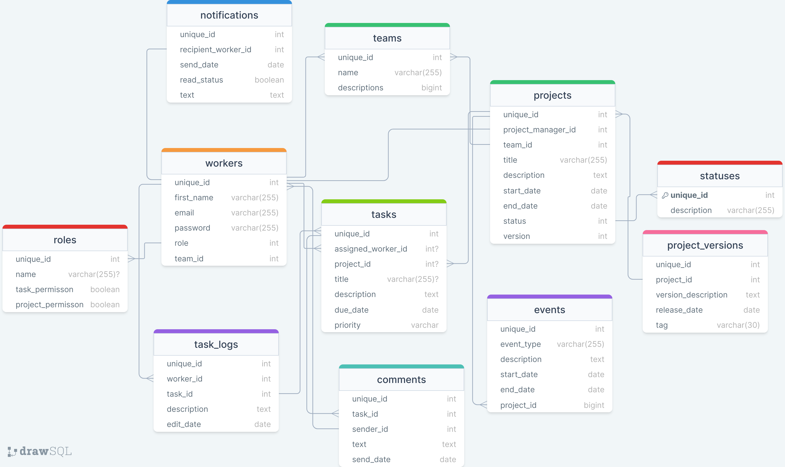

# DM-DMBS

Data models and database management systems.

# Student Egor Bagrovets group 153504

The project is a CRM system for tracking the development process.

# Functional requirements

Admin
+ Employee management (CRUD)
+ Employee assignment to a team 
+ Project management (CRUD)
+ Tracking deadlines

PM
+ Employee Authorization
+ Task management (CRUD)
+ Tracking project and task deadlines
+ Receive project and task reports
+ Notifications of due dates and changes in tasks and projects
+ Changing the status of tasks
+ Event Management (CRUD)
+ Notifications about due dates and changes in tasks and projects

Employee
+ Worker Authorization
+ Commenting on tasks
+ Logging of task completion time

# DB Schema

# worker

unique_id (PK, int) - Unique identifier of the worker.

team_id (PK, int) - Unique identifier of the team the employee belongs to.

first_name (varchar) - Employee's name.

second_name (varchar) - Last name of the employee.

email (varchar) - E-mail of the employee.

password_hash (varchar) - Employee's password.

role_id (FK , int) - Employee's role in the team or system.

- Relationships to other entities:

team_id is linked to PK from the workers table (one to one).

role_id is linked to PK from the roles table

This entity describes information about employees and their team membership in the CRM system.

# role

unique_id (PK, int) - The unique identifier of the project manager.

- Relationships to other entities:

worker_id is associated with the employee's PK in the workers table. (one to many)

# teams

unique_id (PK, int) - Unique identifier of the team.

project_id (FK, int) - Unique identifier of the project to which this team belongs.

name (varchar) - Team name.

description (text) - Description of the command.

- Links to other entities:

project_id is linked to the project PK in the projects table (one wo many)

By means of this entity a relationship is established between the entities projects and workers as many ot many.

This entity describes the information about teams, their names, descriptions and their belonging to projects in the CRM system.

# projects

unique_id (PK, int) - The unique identifier of the project.

project_manager_id (FK, int) - Unique identifier of the project manager responsible for the project.

title (varchar) - Project title.

description (text) - Project description.

start_date (date) - Project start date.

end_date (date) - Planned end date of the project.

status (varchar) - Project status (e.g. Active, Completed, etc.).

version (FK, int) - Unique identifier of the project version, if such a relationship exists.

- Relationships to other entities:

project_manager_id is related to the PK in the project_manager table (one to many).

version is linked to the PK of the project version in the project_versions table.

This entity describes information about projects, their names, descriptions, start and end dates, status and relationship to the project manager and project version in the CRM system.

# project_versions

unique_id (PK, int) - Unique identifier of the project version.

version_description (text) - Project version description.

release_date (date) - Release date of the version.

This entity describes information about project versions, their description and release dates in the CRM system.

# events

unique_id (PK, int) - The unique identifier of the event.

project_id (FK, int) - Unique identifier of the project to which this event belongs.

event_type (varchar) - Event type (e.g. "Meeting", "Conference", "Seminar", etc.).

description (text) - Description of the event.

start_date (date) - The start date of the event.

- Relationships to other entities:

project_id is associated with the project PK in the projects table (one to many)

This entity describes information about project related events, their types, description and start dates in the CRM system.

# tasks
unique_id (PK, int) - Unique identifier of the task.

assigned_user_id (FK, int) - Unique identifier of the user (employee) to whom this task is assigned.

project_id (FK, int) - Unique identifier of the project to which this task belongs.

title (varchar) - Task title.

description (text) - Task description.

due_date (date) - Deadline for task execution.

priority (varchar) - Task priority (for example, "High", "Medium", "Low", etc.).

- Relationships to other entities:

assigned_user_id is linked to the PK of an employee in the workers table (one to many)

project_id is linked to the PK of a project in the projects table (one to many).

This entity describes information about tasks, their title, description, deadline, priority, and links to users and projects in the CRM system.

# task_logs

unique_id (PK, int) - Unique identifier of the task log entry.

worker_id (FK, int) - The identifier of the worker who made the entry in the task log.

task_id (int) - Unique identifier of the task to which this log entry belongs.

description (text) - Description of the change or event associated with the task.

edit_date (datetime) - The date and time the log entry was made.

Relationships to other entities:

worker_id is associated with an employee in the worker table 

task_id is associated with a task in the tasks table 

This entity describes logs and records of events and changes related to tasks, their descriptions, dates and links to employees and tasks in the CRM system.

# notifications

unique_id (PK, int) - The unique identifier of the notification.

recipient_worker_id (FK, int) - Unique identifier of the notification recipient employee.

send_date (datetime) - Date and time when the notification was sent.

read_status (varchar) - Read status of the notification (for example, "Read", "Not read").

text (text) - The text of the notification.

Relationships to other entities:

recipient_worker_id is associated with the PK of the employee in the worker table (one to many )

This entity describes information about notifications, their text, date of sending, read status and connection with employees in CRM system.

# comments

unique_id (PK, int) - Unique identifier of the comment.

task_id (FK, int) - Unique identifier of the task to which this comment belongs.

sender_id (FK, int) - Unique identifier of the comment sender (assuming it is an employee or user of the system).

text (text) - The text of the comment.

send_date (datetime) - The date and time the comment was sent.

Relationships to other entities:

task_id is associated with the PK of the tasks table

sender_id is linked to the PK of the workers table.

This entity describes information about comments to tasks, their text and time of sending in CRM system.